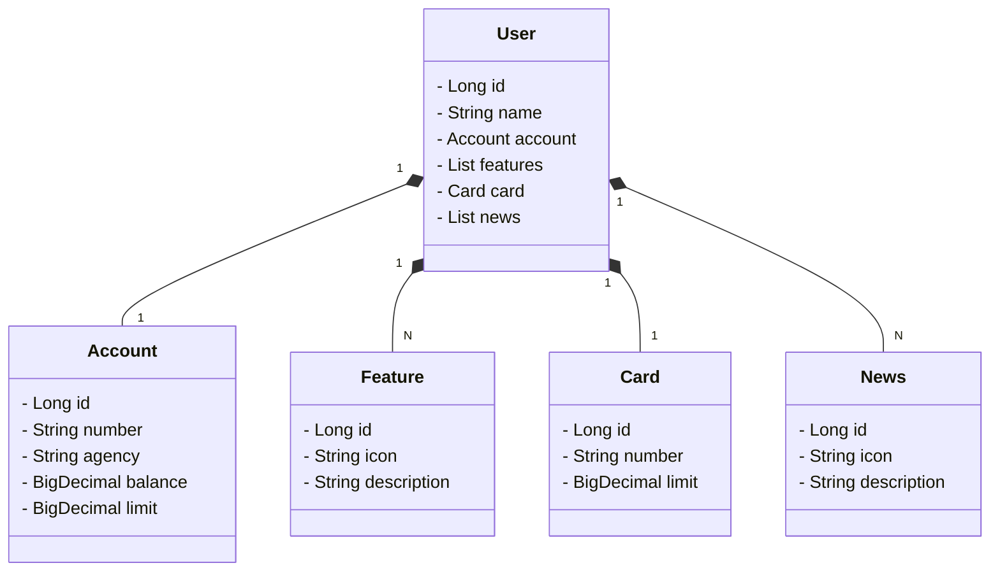

# Santander Dev Week 2023
Java Restful API criada para a Santander Dev Week

## Diagrama de Classes

```mermaid
classDiagram
    class User {
        - Long id
        - String name
        - Account account
        - List<Feature> features
        - Card card
        - List<News> news
    }
    
    class Account {
        - Long id
        - String number
        - String agency
        - BigDecimal balance
        - BigDecimal limit
    }
    
    class Feature {
        - Long id
        - String icon
        - String description
    }
    
    class Card {
        - Long id
        - String number
        - BigDecimal limit
    }
    
    class News {
        - Long id
        - String icon
        - String description
    }

    User "1" *-- "1" Account
    User "1" *-- "N" Feature
    User "1" *-- "1" Card
    User "1" *-- "N" News
```
